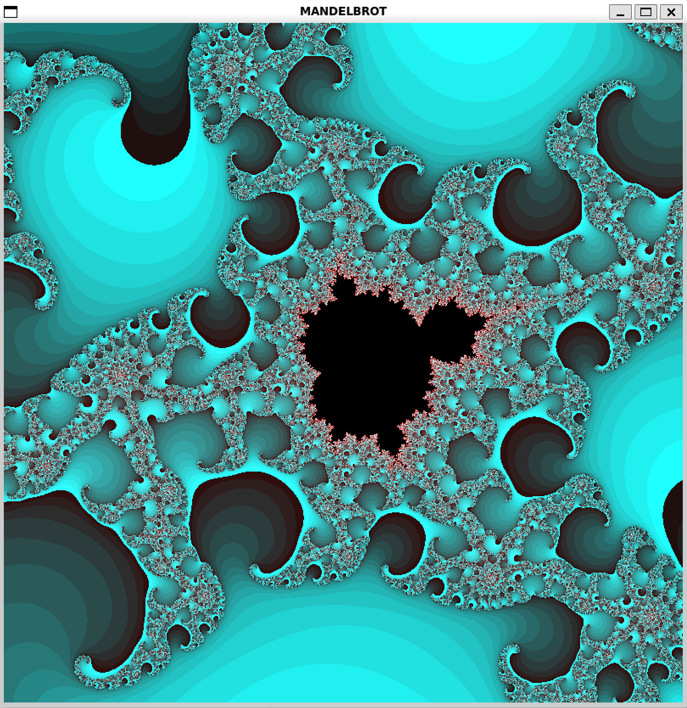
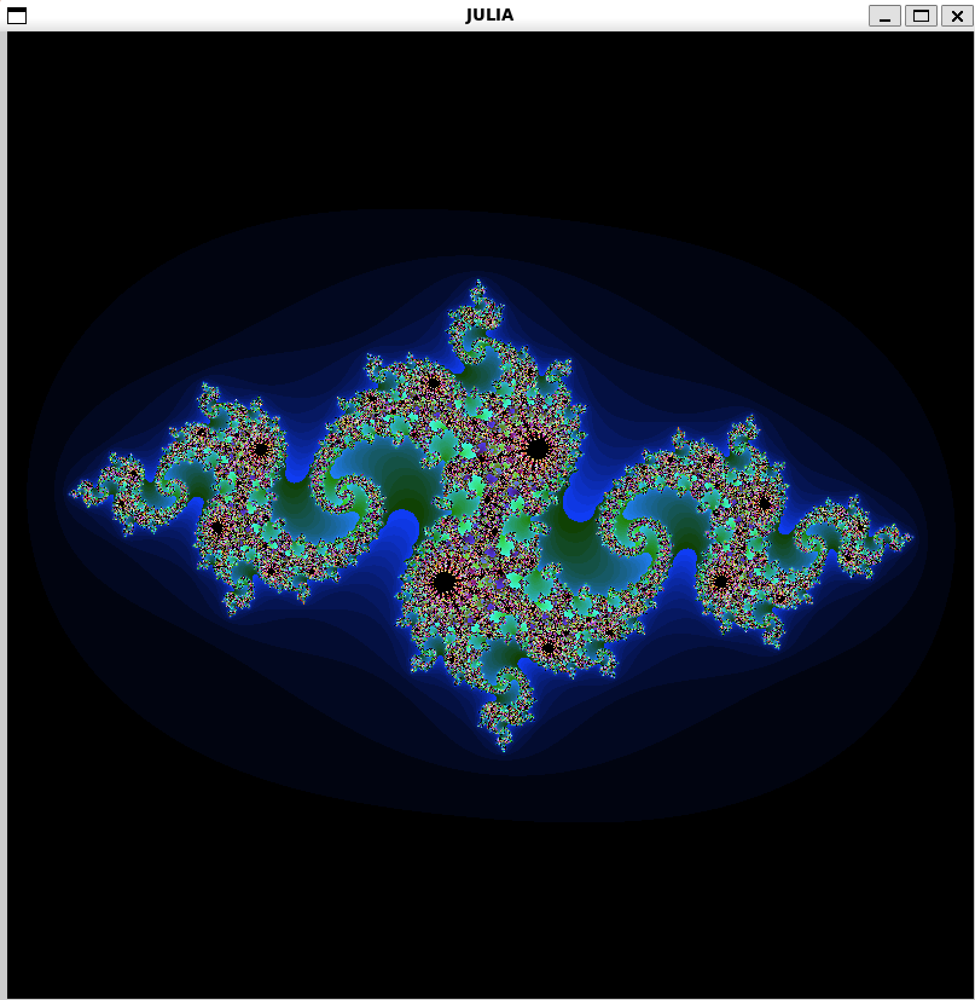
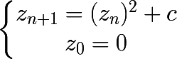

# 👉 FRACTOL : A 42 PROJECT👈

<p align="left">
 
</p>
<p align="right">
  
</p>

## GRADE
✅ 115 %

## DESCRIPTION
Using the minilibx (the 42 graphic library), this is one of the first graphical project at 42 School!

## PROGRAM
For the mandatory part, you need to implement two fractals : mandelbrot and julia. 
Using a "simple" mathematic equation, you will create some beautiful psychedelic effects. 

To get started, you can look at complex numbers and at the following equation : 
<p align=left>
 
</p>
 
## COMMANDS

| KEYS | DESCRIPTION |
| ------------- | ------------- |
| ``ESC``  | Close the window |
| ``SPACE`` | Change fractal color |
| ``+`` && ``-`` | Adding more iterations, change the sharpness |
| ``⬆️ ⬇️ ⬅️ ➡️`` | Change the viewport |
| ``MOUSE SCROLL`` | Zoom in and zoom out |
 
## RUNING FRACTOL

First you need to compile the program using :
```make```

 Then you need to choose between 2 fractals set :
 - Mandelbrot : ```./fractol <mandelbrot>```
 - Julia : ```./fractol <julia> <starting_values>```
Choose starting values between -2.0 and 2.0 !
